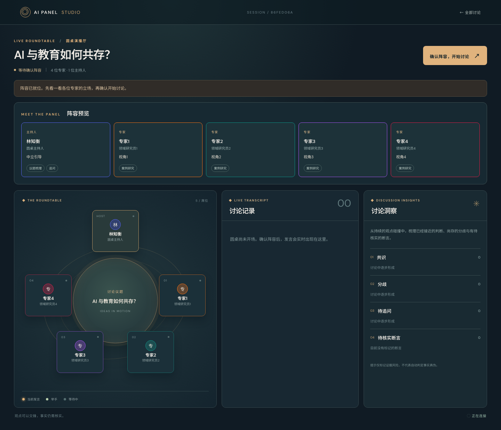
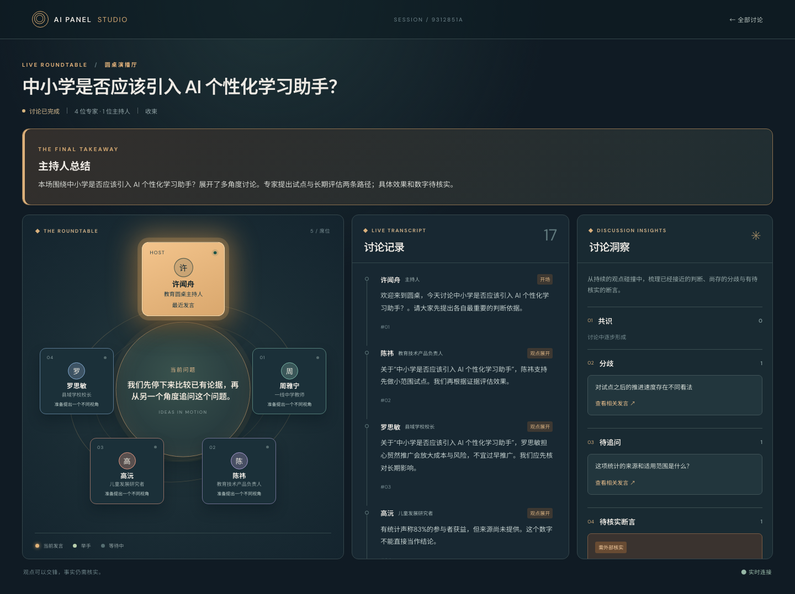
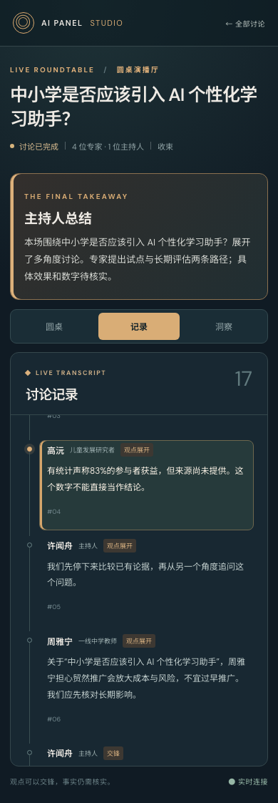
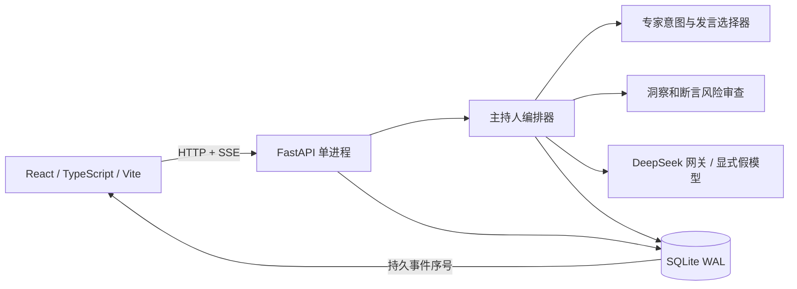
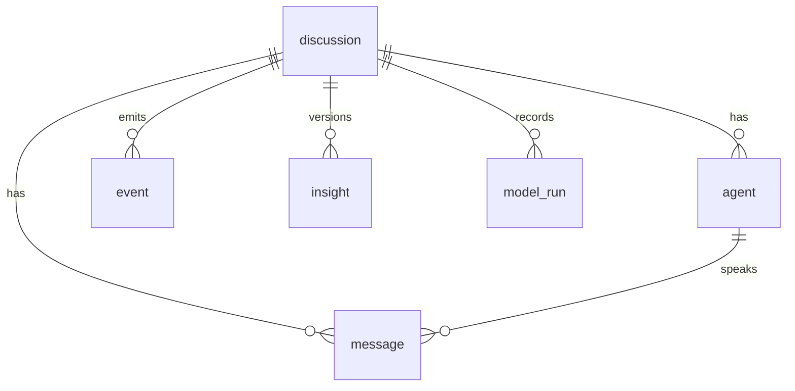

# AI Panel Studio — AI 圆桌演播厅

一个本地运行的 AI 圆桌讨论 Web App：输入议题，确认主持人和 2–6 位不同立场的专家，让他们依据实时上下文自主举手、发言、补充或质疑；讨论记录、观点洞察和待核实断言同步更新。结束后显示自然语言总结。五条预设议题可不调用模型直接进入阵容确认。

> 交付定位：远程作业 MVP。事实风险提示不是联网事实核查，也不代表自动判定真伪。

## 本地环境与安装

已在 macOS、Python 3.13.9、Node.js 26.4.0、npm 11.17.0 验证。后端声明支持 Python ≥3.11；其他 Node 版本尚未单独验收。

```bash
# 在仓库根目录
python3 -m venv backend/.venv
backend/.venv/bin/python -m pip install -e 'backend[test]'
npm --prefix frontend ci
```

启动两个终端，均从仓库根目录进入对应目录：

若只需最快体验，在仓库根目录运行 `bash scripts/start-local.sh`，它会同时启动前后端，默认强制使用假模型，即使当前 shell 已有 DeepSeek Key 也不会产生真实模型调用；按 `Ctrl+C` 结束。下面的双终端方式适合开发调试。

```bash
# 终端 A：后端。先用假模型演示，不产生 API 费用。
cd backend
APP_FAKE_MODEL=1 .venv/bin/python -m uvicorn app.main:app --host 127.0.0.1 --port 8000
```

```bash
# 终端 B：前端
cd frontend
npm run dev
```

打开 [http://127.0.0.1:5173/](http://127.0.0.1:5173/)。访问的是前端 5173 端口；Vite 自动把 `/api` 转发给 8000 端口的 FastAPI。若出现“无法访问此站点”，先确认两个终端都仍在运行，再分别访问 5173 和 [后端接口](http://127.0.0.1:8000/api/discussions)。不要用含 Key 的 URL。

### 使用真实 DeepSeek API

将 `backend/.env.example` 复制为 `backend/.env`，只在本机填入 `DEEPSEEK_API_KEY`；`backend/.env` 已被 Git 忽略。确认 `APP_FAKE_MODEL=0`，然后在后端终端执行：

```bash
cd backend
set -a
source .env
set +a
.venv/bin/python -m uvicorn app.main:app --host 127.0.0.1 --port 8000
```

默认模型 ID 是 `deepseek-chat`，可用 `DEEPSEEK_MODEL` 更改；实际可用模型取决于账号。Key 只由后端读取，不进入浏览器、前端构建包或 SQLite。请只开一个 Uvicorn worker：编排任务与实时通知保存在该进程中，多 worker 不是此 MVP 的部署形态。真实讨论会调用多次模型，可能产生费用；先用假模型试用界面。

需要复跑独立烟测时，先确认 Key 已在后端终端环境中；`cd backend && .venv/bin/python -m app.smoke` 为免费的假模型试跑，额外添加 `--real` 才会发出可计费 DeepSeek 请求。真实烟测默认 2 位专家但仍包含完整 12 个专家回合，不能视为单次廉价 API Ping。

## 演示路径

1. 首页从五条示例中选一个，或输入自定义议题（1–500 字，默认四位专家）。
2. 检查主持人与专家身份、立场、专长，点击“确认阵容，开始讨论”。
3. 看圆桌高亮、举手状态、逐条发言和洞察。点击“待核实断言”的“查看原发言”可定位证据来源。
4. 刷新页面：先取得完整快照，再从最后事件序号补接实时流；断线时保留旧内容并显示重连状态。
5. 结束后查看主持人总结；在 390px 左右窄屏用“圆桌 / 记录 / 洞察”标签切换。







## 架构与数据





`discussion` 保存议题、状态、阶段、总结和最后事件序号；`agent` 仅保存可公开身份、立场与状态；`message` 是完整发言；`insight` 版本化保存共识、分歧、待追问与风险；`event` 保证断线补发；`model_run` 记录目的、耗时和错误码。SQLite 使用 WAL，所有事件与对应状态变化在同一事务提交。应用启动时导入五条固定 ID 的示例（教育、交通、健康传播、开源 AI 治理、传统文化），重复启动不会重复导入。

## 接口

| 方法 | 路径 | 用途 |
| --- | --- | --- |
| `POST` | `/api/discussions` | 创建议题；异步生成阵容 |
| `GET` | `/api/discussions` | 列出历史和进行中讨论 |
| `GET` | `/api/discussions/{id}` | 获取完整快照 |
| `POST` | `/api/discussions/{id}/start` | 确认阵容后开始 |
| `POST` | `/api/discussions/{id}/resume` | 从失败检查点继续 |
| `GET` | `/api/discussions/{id}/events?after=N` | SSE 顺序补发与实时更新 |

前端连接时先 GET 一致性数据库快照，再用 `last_event_seq` 作为 SSE 的 `after` 参数。重复序号及已存在的消息 ID 都会被忽略，跳号重新抓快照；浏览器自动重连，持续失败后以只读轮询兜底。讨论之间按 ID 隔离，最多四个并发模型请求。专家每次自主提交公开意图，选择器综合相关性、新颖度、紧迫度与发言公平性选人；不是固定轮流说话。发言约束为 1–2 句。主持人负责开场、转场、事实追问与总结。每场最多 100 次模型调用、20 分钟；六位专家时可能在约 11 轮专家发言后提前收束，以预留结束语、总结和一次失败重试的额度。

事实风险分为“记录冲突 / 来源未提供 / 需外部核实”，每条均指向真实发言 ID 和原句；这仅是证据风险标记。未连接外部权威数据库时，系统不会宣称某个外部事实已经被证实或证伪。模型审查失败会记录并显示为“本轮审查暂不可用”，刷新后仍可定位未审查发言，但不会删除原发言。全体专家连续两轮都无法提交意愿时，讨论会暂停供用户继续，不会伪装成正常完成；若反复恢复最终耗尽 100 次调用预算，会明确标为不可继续，保留已生成的内容，而不是显示一个假的完成总结。

## 验证

```bash
# 仓库根目录
backend/.venv/bin/python -m pytest -q backend/tests
npm --prefix frontend test -- --run
npm --prefix frontend run build
cd frontend && npx playwright test
```

Playwright 测试会自己启动显式假模型后端和前端，使用 `frontend/test-results/` 下的独立 SQLite 文件，不调用真实 API；运行前请先停止占用 8000、5173 端口的本地开发服务。测试覆盖刷新恢复、风险定位、移动标签和两场讨论隔离。

## 交付与边界

- [开发 Prompt 记录](docs/prompt-log.md) 与 [工作流说明](docs/workflow.md) 如实记录实际使用 Codex 开发、DeepSeek 运行时生成；没有声称使用过未使用的工具或模型版本。
- [真实 DeepSeek 冒烟记录](docs/real-api-smoke.md) 单独列出耗时、调用次数、输出质量与未核实风险，不与假模型结果混淆。
- 五条示例保存在 [`backend/data/seed_examples.json`](backend/data/seed_examples.json)，截图来自真实浏览器运行。
- 这是本机单用户 MVP：没有用户登录、外部网页证据检索、生产级任务队列或多 worker 部署。SSE 连接需要运行中的后端，离线时旧记录仍在 SQLite 中。
- 提交前由用户亲自核对 GitHub/Gitee 仓库、文档、截图、运行效果与压缩包。邮件发送由用户决定，本项目不会自动发送。
