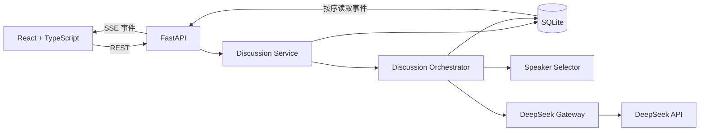
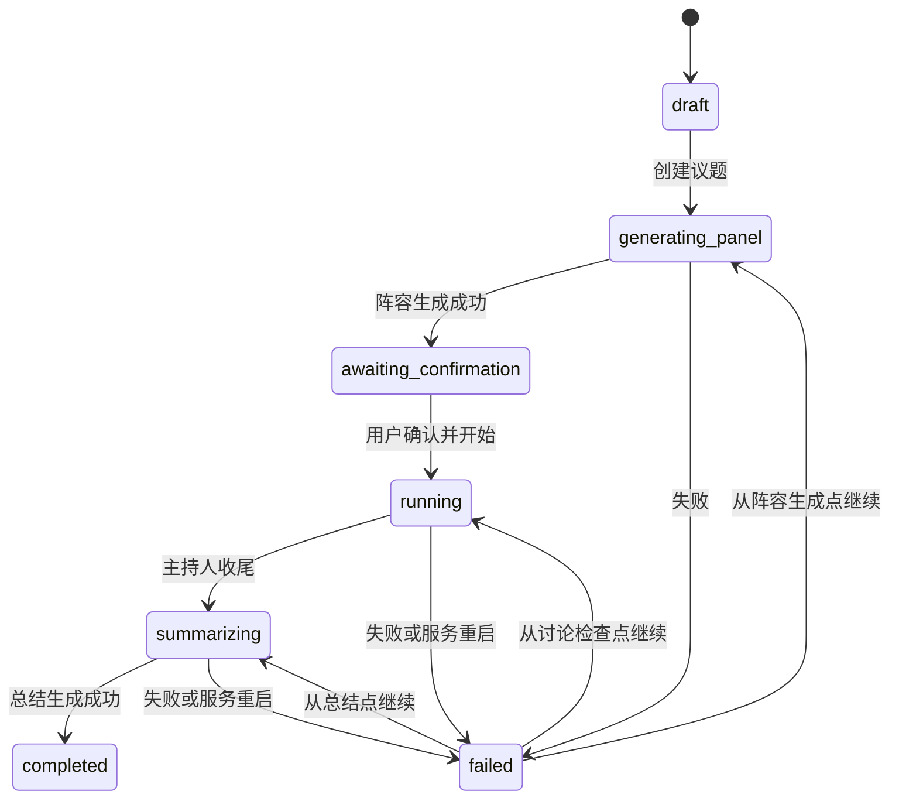
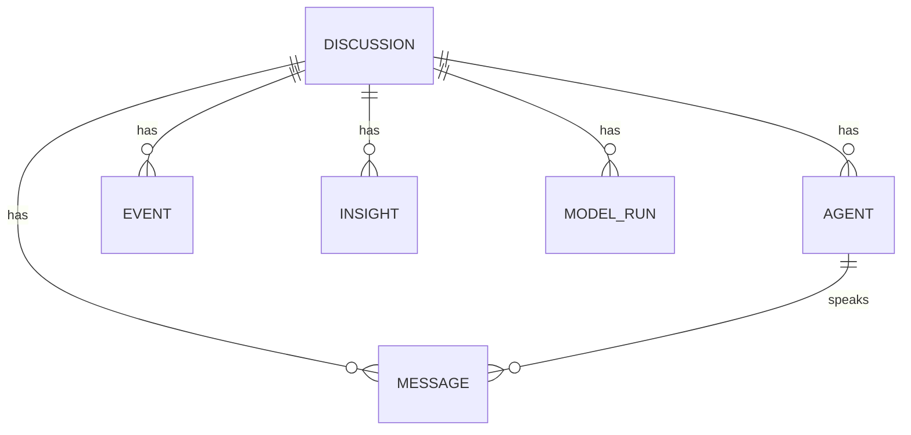

# AI Panel Studio MVP 设计规格

日期：2026-09-23
状态：待用户审阅的设计稿

## 1. 目标与约束

这是“AI 圆桌讨论 Web App MVP”远程作业。用户有约 72 小时的提交窗口、约 48 小时的实际投入时间，熟悉 Python、接触过 FastAPI，React/TypeScript 需要边做边讲。目标是交付可在本机运行、能完整演示并有真实开发记录的成品。开发过程使用 Codex，应用运行时调用用户自己的 DeepSeek API；工作流文档如实记录使用过的工具。

完成的判断标准：用户输入任意议题并指定专家人数后，可确认 AI 生成的阵容，观看主持人与专家进行非固定顺序的讨论；页面实时显示发言、公开 Agent 状态、共识与分歧；结束时呈现自然语言总结。两场讨论可并行运行且数据不串台。项目有测试、五条高质量示例、Prompt 记录和清晰的 Git 历史。

### 本次 MVP 包含

- 首页：历史及进行中的讨论列表、创建议题入口、五条预设示例入口。
- 阵容生成与确认：默认四位专家，用户可选 2～6 位；AI 生成一位主持人和专家的姓名、职业/Title、立场、专长标签及显示色。
- 圆桌演播厅：主持人控场，专家依据当前上下文各自决定是否举手、补充、质疑或回应；每次发言 1～2 句。
- 实时展示：专家席位状态、公开意图摘要、讨论记录、持续更新的共识/分歧/待追问点。
- 完成与恢复：自然语言总结、断线补接、模型失败后的继续按钮。

### 本次不包含

账号登录、多人协作编辑、语音、头像生成、自动部署、复杂动画和长期运行的分布式任务系统。限制范围是为了优先完成可验证的讨论闭环。

## 2. 用户流程与页面

前端采用 React + TypeScript + Vite，中文 UI。首页同时放讨论列表和创建表单。创建成功后进入 `/discussions/:id`；该页面依据讨论状态显示阵容生成进度、阵容确认、圆桌演播厅、失败恢复或最终总结。这样不需要为每个状态建立单独路由。五条示例以静态种子文件保存议题与对应阵容，初始化后成为可直接确认的讨论；普通新议题仍由 DeepSeek 动态生成阵容。

桌面端演播厅有三个各自滚动的区域：圆桌席位、实时讨论记录、共识与分歧。圆桌是主要视觉焦点，主持人和专家围桌就座，桌心显示当前问题；正在发言的席位使用整块高对比色、光晕和文字状态，举手席位有独立标识，记录区域同步突出当前发言。只展示模型生成的可公开意图摘要，例如“准备补充课堂案例”，绝不展示或保存模型隐藏推理内容。窄屏通过“圆桌 / 记录 / 洞察”标签切换当前区域，保持区域自身滚动。结束后显示自然语言总结，不呈现原始 JSON。

交互草图保存在项目的临时可视化会话中，正式实现以本规格为准。

## 3. 系统架构与边界

- **API 层**：参数校验、HTTP 状态码、SSE 连接和响应格式。
- **Discussion Service**：创建讨论、确认阵容、启动/继续、查询快照；阻止同一讨论重复启动。
- **Orchestrator**：推进讨论状态和阶段，控制主持人介入、轮数与终止条件。每个 `discussion_id` 有独立运行任务与锁。
- **Speaker Selector**：接收专家各自的发言意愿，用明确规则选下一位；选择算法可单独测试。
- **Model Gateway**：封装 DeepSeek 请求、结构化输出校验、超时、有限重试和调用记录。`DEEPSEEK_API_KEY` 只从后端环境变量读取，模型 ID 由 `DEEPSEEK_MODEL` 配置。
- **Repository / Event Stream**：SQLite 持久化讨论、发言和事件；事件先提交数据库，再广播。SSE 从事件表按序号补发，因此刷新后可续接。

本地 MVP 采用单个 FastAPI worker、异步模型调用和多个按议题隔离的后台任务。SQLite 开启 WAL、busy timeout，数据库事务保持短小；全局模型调用并发数受限。该部署边界写进 README，不宣称支持多进程水平扩容。

DeepSeek 官方 Python 示例使用 `DEEPSEEK_API_KEY` 与 `https://api.deepseek.com`，本项目据此设计模型网关；请求参数和实际模型 ID 在联调时以账号可用能力为准。参考：[DeepSeek Python 示例](https://api-docs.deepseek.com/api_samples/chat_python/)、[JSON Output 说明](https://api-docs.deepseek.com/guides/json_mode/)。

## 4. 讨论状态机

`running` 内部按 Opening → Exploration → Challenge → Synthesis → Closing 推进。阶段是控场提示，而不是固定发言名单。服务重启时，未完成的后台任务标为可恢复失败状态；用户点击“继续”后从最近一次已提交的检查点推进。已保存的消息不得重复展示。同一讨论的第二个启动请求返回冲突；不同讨论互不阻塞。

## 5. 数据模型

| 对象 | 关键字段 | 作用 |
| --- | --- | --- |
| `Discussion` | `id`, `topic`, `expert_count`, `status`, `stage`, `expert_turns`, `summary`, `last_event_seq`, `resume_point`, `error_code`, 时间戳 | 一场讨论的当前状态和恢复点 |
| `Agent` | `id`, `discussion_id`, `kind`, `name`, `title`, `stance`, `specialties`, `color`, `public_status`, `public_intent` | 主持人/专家身份与可公开状态 |
| `Message` | `id`, `discussion_id`, `agent_id`, `sequence`, `stage`, `content`, 时间戳 | 可读 transcript；同场 `sequence` 唯一 |
| `Event` | `id`, `discussion_id`, `sequence`, `type`, `payload`, 时间戳 | SSE 补发与界面同步；同场 `sequence` 唯一 |
| `Insight` | `id`, `discussion_id`, `version`, `consensus`, `disagreements`, `open_questions` | 共识/分歧版本快照；每条洞察内含来源消息 ID |
| `ModelRun` | `id`, `discussion_id`, `purpose`, `model`, `status`, `latency_ms`, `token_usage`, `error_code`, 时间戳 | 调试和成本观察，不存 API Key 或隐藏推理 |

所有下属表都有 `discussion_id` 外键。主持人与专家的模型输入只从对应讨论读取。共识必须能指向支持它的发言；分歧必须能指向不同观点的发言。无足够证据时留空，不制造“共识”。

## 6. HTTP 与 SSE 契约

| 接口 | 输入 | 输出/行为 |
| --- | --- | --- |
| `POST /api/discussions` | `topic`, `expert_count`（默认 4，范围 2～6） | 返回 `id` 与 `generating_panel`，异步生成阵容 |
| `GET /api/discussions` | 可选分页参数 | 返回讨论摘要列表 |
| `GET /api/discussions/{id}` | 讨论 ID | 返回状态、阵容、消息、最新洞察、总结及 `last_event_seq` |
| `POST /api/discussions/{id}/start` | 讨论 ID | 仅在 `awaiting_confirmation` 启动，其他状态返回 `409` |
| `GET /api/discussions/{id}/events` | `Last-Event-ID` 或 `after` | SSE 按序补发并持续推送该讨论的新事件 |
| `POST /api/discussions/{id}/resume` | 讨论 ID | 仅对可恢复失败状态有效，从 `resume_point` 继续 |

事件包括 `discussion.status`、`panel.ready`、`agent.updated`、`message.created`、`insight.updated`、`discussion.completed` 和 `discussion.failed`。客户端先读取详情快照，再从 `last_event_seq` 之后建立 SSE 连接，并按事件序号去重。事件只在数据库提交成功后推送。

## 7. 多 Agent 编排算法

1. 生成阵容时让模型输出结构化数据，后端校验姓名、身份、立场和专长字段。主持人固定为一位。
2. 主持人介绍议题、阵容与第一问。
3. 每轮各专家并行收到自己的身份、当前阶段和问题、最近发言及最新洞察；各自返回结构化意愿：`wants_to_speak`、动作（回答/补充/质疑/追问）、回应目标、相关性、新颖度、紧迫度和可公开意图摘要。
4. Selector 对有效意愿打分。相关性、新颖度、有根据的直接反驳加权；最近发言次数降权，尚未表达的视角轻度加权。固定名单顺序不能决定下一位。
5. 选中专家生成 1～2 句发言，经长度和格式校验后持久化；状态变化与消息分别形成事件。每 2～3 次专家发言更新洞察。主持人根据重复度、未答问题及阶段目标决定追问或推进。
6. 目标约 12 次专家发言和 4～6 次主持人发言；设置消息数、模型调用数和总耗时上限，达到上限时主持人收尾并生成总结。没有真实分歧时展示待验证问题。

上下文按 `discussion_id` 构建，包含角色设定、阶段目标、当前问题、最近消息和最新洞察摘要。模型返回的隐藏推理字段不会进入 Agent 状态、事件、数据库或页面。

## 8. 故障与恢复

- 模型超时、限流、空响应或无效结构化输出：网关记录错误码并有限重试；重试仍失败时保留已提交内容，标记可恢复失败。
- 单个专家的意愿请求失败：本轮视为该专家弃权，其余专家继续；全员连续失败时主持人尝试重述问题，仍失败才暂停讨论。
- 发言或总结失败：仅重做未提交步骤，不覆盖已保存的 transcript；每个步骤有检查点以防重复发言。
- SSE 断开：客户端用最后收到的事件序号重连并补发，不会重新触发模型调用。
- 服务重启：检测未完成讨论，标记为可恢复，等待用户主动继续。
- API Key 缺失：后端启动或调用前返回明确配置错误，前端不接触密钥。

## 9. 验收与测试

自动化测试使用假模型网关，保持输出确定且不消耗 API 配额：

- 单元测试：状态转换、Speaker Selector 非固定轮流且有公平性、结构化输出校验、洞察来源校验。
- API/集成测试：创建 → 阵容确认 → 讨论 → 洞察 → 总结；失败与继续；SSE 补发；两场讨论交错运行但数据隔离。
- 浏览器 E2E：完成一场讨论、刷新后恢复 UI、圆桌状态与 transcript 同步、窄屏切换和独立滚动、总结页面无原始 JSON 或隐藏推理。
- 人工真实 API 冒烟测试：用用户自己的 DeepSeek Key 跑一场短讨论，观察延迟、结构化输出、内容质量和错误提示；不把 Key 提交到 Git。

交付前准备至少五条含议题和高质量阵容的预设数据，保存为可重复导入的种子文件，并逐条检查可完整运行。Git 历史按设计、数据/API、界面、编排、测试与文档等真实阶段演进，不在结束时一次性提交。

## 10. 交付文档

- `README.md`：运行指令、环境变量、功能说明、API 列表、技术说明、Mermaid 架构与 ER 图、测试方法和已知边界。
- 核心 Prompt 记录：至少五段，覆盖数据/API、前端、编排与业务逻辑、E2E 调试；每段记录当时意图、遇到的问题、修改及如何引导 AI 修正。
- 1～1.5 页开发过程与工作流说明：如实描述 Codex 与 DeepSeek 在项目中的用途、2～3 个真实问题及解决路径、对 AI 辅助工程开发的理解。
- 项目源码、SQLite 初始化方式、`.env.example`、五条种子数据、测试及必要的演示截图。提交包和仓库链接按作业要求整理，提交邮件在最终检查后由用户决定发送。

## 11. 实施顺序

先完成数据模型和 API 契约，再做阵容生成与讨论编排，随后完成圆桌界面及 SSE，最后做隔离/恢复测试、五条示例和交付文档。每个阶段先明确可验证结果，再写实现与提交。用户可以跟着每阶段理解状态、接口、Agent 编排和测试依据。
